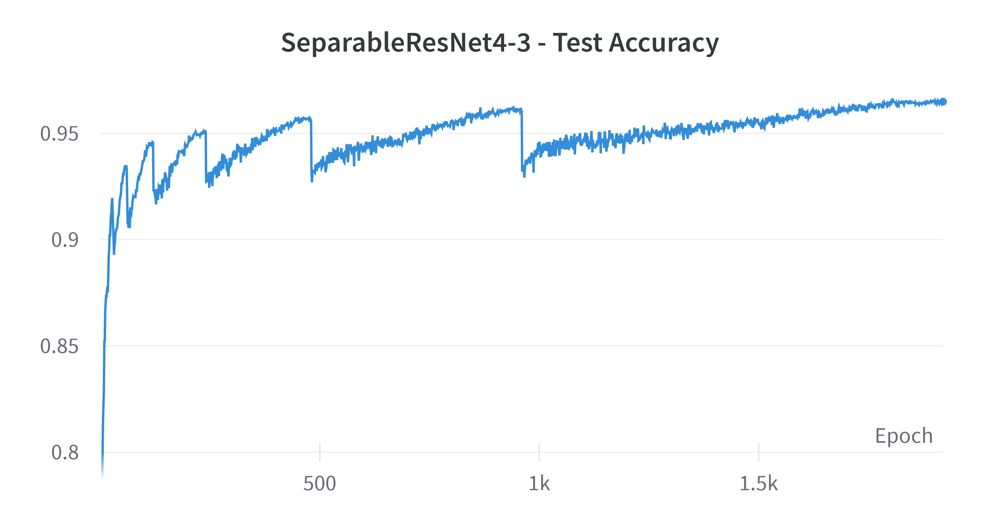

# SeparableResNet

Experimenting with *Deep Learning* ideas and *Convolutional Neural Networks* on my laptop.

## Network Architecture
The network architecture employs **skip connections** as in [*ResNet*](https://arxiv.org/abs/1512.03385) and **depthwise separable** convolutions as in [*MobileNet*](https://arxiv.org/abs/1704.04861).

## Training recipe
**Old tricks**
- Data Augmentation
    - Random Horizontal Flip
    - Trivial Augmentation Wide
    - Random Erasing
- Weight Decay

**New Tricks**
- Gradient Norm Clipping
- LR Schedule: Cosine Annealing with Restarts
- Label Smoothing

*Old tricks* is common practice whereas *new tricks* is not. 

## Results on CIFAR10
Model format is: *SeparableResNet\<width-factor>-\<depth-factor>*

|Model             |Parameters|Test Accuracy|
|     :---:        |   :---:  |    :---:    |
|SeparableResNet4-3|   0.45M  |     96.09   |

Weights are available under `trained-models`. Look at `check_results.py` on how to use them.

### Test Accuracy Breakdown
| Epoch | Test Accuracy |
| :---: | :---: |
| 30    | 92.28 |
| 60    | 93.34 |
| 120   | 94.56 |
| 240   | 95.00 |
| 480   | 95.65 |
| 960   | 96.09 |
| 1920  | 96.49 |

From the progression it looks like further improvements are possible but this would require many days of training on my laptop.

### Insight
I think the good performances are due more to the training recipe than the network architecture.